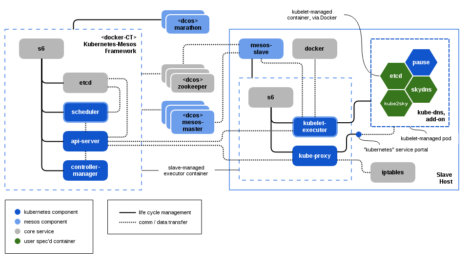

## Overview

This package contains scripts to build the DCOS Kubernetes docker container image.



## Usage

```shell
$ make clean
$ make build
$ make push
```

If you source directory is not clean, this will be reflected in the Docker tag with "dirty" and "unclean".

Optionally the version might be specified:

```shell
$ GIT_REF=v1.0.5-v0.6.1 make build
$ GIT_REF=v1.0.5-v0.6.1 make push
```

Moreover, there are the following variables can be customized via the command line:

```make
GIT_REPO ?= mesosphere/kubernetes
DOCKER_ORG ?= mesosphere
```

## Development and Testing

The Docker container can be run manually outside of a DCOS cluster, e.g.:

```
docker run --rm --name=k8s -e GLOG_v=3 -e HOST=<docker-host-IP> \
  -e K8SM_MESOS_MASTER=<mesos-master-ip>:5050 \
  -e DEFAULT_DNS_NAME=<docker-host-IP> \
  -e MESOS_SANDBOX=/tmp \
  --net=host -it mesosphere/kubernetes:k8s-1.0.pre-k8sm-0.6-dcos-dev
```

## Files
* Makefile - coordinate the build process: build s6, bundle it with km into a Docker and push the repo
* Dockerfile - recipe for building the docker
* bootstrap.sh - default target of Dockerfile, launches the framework: apiserver, scheduler, controller
* leapsecs.dat - requirement for s6 to work properly

## Walkthrough w/ the guestbook examples

Some prerequisites:

- set up a DCOS cluster
- install the `kubernetes` app using the DCOS CLI tooling
  - `dcos package install kubernetes`

- build yourself a kubectl using the Kubernetes build process (`make`)
- wait until kubernetes is up


```shell
$ export KUBERNETES_MASTER=http://{the-dcos-host-your-kubernetes-master-is-running-on}/services/kubernetes/api

$ bin/kubectl get pods --all-namespaces
NAMESPACE     NAME                READY     STATUS    RESTARTS   AGE
kube-system   kube-dns-v8-vruvs   4/4       Running   0          22h
kube-system   kube-ui-v1-1r5km    1/1       Running   0          22h

$ bin/kubectl create -f kubernetes/examples/guestbook/redis-master.json 
pods/redis-master-2
$ bin/kubectl create -f kubernetes/examples/guestbook/redis-master-service.json 
services/redismaster
$ bin/kubectl create -f kubernetes/examples/guestbook/redis-slave-controller.json 
replicationControllers/redis-slave-controller
$ bin/kubectl create -f kubernetes/examples/guestbook/redis-slave-service.json 
services/redisslave
$ bin/kubectl create -f kubernetes/examples/guestbook/frontend-controller.json 
replicationControllers/frontend-controller
$ bin/kubectl create -f kubernetes/examples/guestbook/frontend-service.json 
services/frontend

$ bin/kubectl get pods
POD                        IP          CONTAINER(S)  IMAGE(S)        HOST                             LABELS         STATUS   CREATED
frontend-controller-jf2zt  172.17.0.8  php-redis     jdef/php-redis  ec2-52-24-192-202.../10.0.0.221  name=frontend  Running  51s
frontend-controller-kypr9  172.17.0.6  php-redis     jdef/php-redis  ec2-52-24-218-42.../10.0.0.223   name=frontend  Running  51s
...

$ bin/kubectl exec -p frontend-controller-jf2zt -c php-redis -ti curl http://frontend
<html ng-app="redis">
  <head>
    <title>Guestbook</title>
...
```
